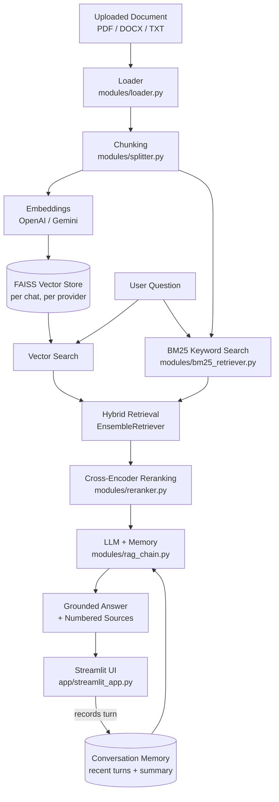

# Hoopoe — Enterprise Knowledge Assistant

## Problem Statement

Employees need quick, trustworthy answers to questions about internal documents — HR policies, IT guidelines, benefits, travel rules — without digging through PDFs and Word files themselves. A plain chatbot can't be trusted for this: it either doesn't know the company's specific policies, or worse, guesses confidently and gets details wrong. What's needed is an assistant that answers *only* from the actual documents, always shows exactly which document (and which passage) it drew from, and says so plainly when the documents don't have the answer.

## Solution Overview

Hoopoe is a Retrieval-Augmented Generation (RAG) chatbot, built with Python, LangChain, and Streamlit, that answers questions grounded in uploaded documents. A user uploads a PDF, DOCX, or TXT file; Hoopoe chunks it, embeds it, and indexes it into a local FAISS vector store scoped to that chat session. Every question then runs through a hybrid retrieval pipeline (vector similarity search combined with BM25 keyword search) followed by cross-encoder reranking, so the LLM only ever sees the handful of chunks most relevant to the question. The LLM's answer carries numbered `[1]…[n]` citations built directly from that same chunk list — never parsed out of the LLM's text — so the sources shown to the user are always exactly the passages the answer was built from. If nothing relevant enough was retrieved, Hoopoe says so instead of guessing. Conversations carry both short-term memory (the last few turns) and a running summary, and both OpenAI and Gemini are supported as interchangeable chat/embedding providers throughout.

## Architecture



## Technology Stack

- **Language / runtime**: Python 3.11
- **UI**: Streamlit
- **Orchestration**: LangChain (`langchain`, `langchain-community`, `langchain-core`, `langchain-text-splitters`)
- **LLM & embeddings**: OpenAI (`langchain-openai`) and Google Gemini (`langchain-google-genai`) — interchangeable via config
- **Vector store**: FAISS (`faiss-cpu`), one index per chat session per embedding provider
- **Keyword search**: BM25 (`rank-bm25`, via `langchain_community.retrievers.BM25Retriever`)
- **Reranking**: local cross-encoder via `sentence-transformers` (`cross-encoder/ms-marco-MiniLM-L6-v2`) — no extra API or hosted service
- **Document parsing**: `pypdf` (PDF), `python-docx` (DOCX)
- **Config**: `PyYAML` (`config/config.yaml` — every tunable value lives here, nothing hardcoded)
- **Secrets**: `python-dotenv` (`config/.env`)

## Project Structure

```text
RAG_CHATBOT/
├── app/
│   ├── streamlit_app.py       # Main Streamlit application (chat UI, indexing, sources, memory)
│   ├── gradio_app.py          # Placeholder only — not implemented, not in scope
│   └── assets/                # Logo and favicon images
├── config/
│   ├── config.yaml            # All configurable values: providers, chunking, retrieval, reranking, prompt, memory, upload, logging
│   └── .env                   # OPENAI_API_KEY / GEMINI_API_KEY — not committed to source control
├── data/
│   ├── sample_docs/           # 8 sample one-page HR documents for a fictional company, for testing
│   └── uploads/<chat_id>/     # Uploaded files, created at runtime, grouped per chat session
├── logs/
│   └── hoopoe.log             # Rotating application log (level/path set in config.yaml)
├── modules/
│   ├── __init__.py
│   ├── utils.py                # load_config(), get_logger(), get_embedding_model()
│   ├── loader.py                # PDF / DOCX / TXT loading into LangChain Documents
│   ├── splitter.py              # Chunking (RecursiveCharacterTextSplitter)
│   ├── embedder.py               # FAISS index create / load / self-healing rebuild, per chat + provider
│   ├── bm25_retriever.py         # BM25 keyword retriever, built fresh from each chat's chunks
│   ├── retriever.py               # get_hybrid_retriever() — combines FAISS + BM25 (EnsembleRetriever)
│   ├── reranker.py                # CrossEncoderReranker — rescoring and top-k selection
│   ├── memory.py                   # Recent-turn memory + running conversation summary
│   └── rag_chain.py                 # RetrievalPipeline, build_chat_chain, build_rag_chain, citations, hallucination guard
├── vectorstores/<chat_id>/<provider>/   # Persisted FAISS indexes (index.faiss + index.pkl)
├── requirements.txt
└── README.md
```

## Setup

1. **Clone the repository and open it in your project folder.**

2. **Create and activate a virtual environment** (Python 3.11 recommended):

   ```powershell
   python -m venv myenv
   .\myenv\Scripts\Activate.ps1
   ```

3. **Install dependencies:**

   ```powershell
   pip install -r requirements.txt
   ```

   The first time reranking runs, `sentence-transformers` downloads the cross-encoder model (~90 MB) — this needs network access once, after which it's cached locally.

4. **Create `config/.env`** with the API key(s) you plan to use (see [Environment Variables](#environment-variables) below).

5. **Review `config/config.yaml`** — every tunable value (LLM/embedding provider, chunk size, hybrid weights, reranking thresholds, memory window, upload limits, log level) lives here. Nothing is hardcoded in the Python modules. Defaults are already set for OpenAI as the provider; switch `llm.provider` / `embedding.provider` to `"gemini"` if you'd rather default to Gemini.

## Environment Variables

Set these in `config/.env` (never commit real keys):

```env
OPENAI_API_KEY=your_openai_api_key_here
GEMINI_API_KEY=your_gemini_api_key_here
```

| Variable | Required for |
|---|---|
| `OPENAI_API_KEY` | OpenAI chat, OpenAI embeddings, **and conversation summary memory** (summary memory always uses OpenAI internally — see [Limitations](#limitations)) |
| `GEMINI_API_KEY` | Gemini chat and Gemini embeddings |

You only strictly need the key for whichever provider(s) you select in `config.yaml` / the sidebar — except `OPENAI_API_KEY`, which summary memory needs regardless of your chat provider choice. Without it, summary memory degrades gracefully to "unavailable" rather than crashing; recent-turn memory keeps working either way.

## Running the App

From the project root:

```powershell
streamlit run app/streamlit_app.py
```

Streamlit will print a local URL, typically:

```text
http://localhost:8501
```

Open it, then:

1. Upload a document from `data/sample_docs/` (or your own PDF/DOCX/TXT, up to the configured size limit) using the sidebar.
2. Click **Index Document**.
3. Ask a question in the chat box.
4. Sources appear as a caption under each grounded answer.
5. Use **New Chat** to start a completely fresh, document-less session, or **Clear Conversation** to reset just the chat history and memory while keeping the currently indexed document.

If no document is indexed yet, Hoopoe still responds — as a general assistant, with no citations — until you index something.

## Sample Inputs & Outputs

The examples below use two of the real sample documents (`leave_policy.docx`, `it_policies.pdf`, both under `data/sample_docs/` for the fictional "Meridian Softworks Pvt. Ltd."). The retrieval, reranking, and citation numbering shown here were verified end-to-end in this project's own automated tests (Module 9); the exact wording an LLM produces will naturally vary a little each time you run it, since that part depends on the live model call.

**1. A question answered from a single document:**

> **You:** How many days of earned leave can I carry forward to next year?
>
> **Hoopoe:** Employees may carry forward up to 10 days of unused Earned Leave to the following year [1]. Casual Leave and Sick Leave do not carry forward and lapse on December 31 [1].
>
> *Sources: leave_policy.docx*

**2. A question that benefits from keyword (BM25) matching, e.g. an exact term:**

> **You:** What are the password requirements for company accounts?
>
> **Hoopoe:** Passwords must be at least 12 characters long and include upper case, lower case, numbers, and symbols [1]. Multi-factor authentication (MFA) is mandatory for email, VPN, and all cloud business applications [1].
>
> *Sources: it_policies.pdf*

**3. A follow-up question testing conversational memory** (same chat as example 1):

> **You:** What about casual leave — does that carry forward too?
>
> **Hoopoe:** No — Casual Leave does not carry forward; it lapses on December 31 each year, unlike Earned Leave, which allows up to 10 days to carry forward [1].
>
> *Sources: leave_policy.docx*

Note how example 3 correctly resolves "that" to leave policy from the ongoing conversation, without the user having to restate the topic — this is the recent-turn memory (and, once a couple more turns accumulate, the running summary) feeding into the prompt.

**4. An off-topic question with a document indexed:**

> **You:** What's the capital of France?
>
> **Hoopoe:** The information was not found in the uploaded documents.

This is the hallucination guard: when nothing retrieved clears the relevance threshold, Hoopoe says so instead of answering from general knowledge or guessing.

## Key Design Decisions

- **Per-chat, per-provider FAISS isolation** (`vectorstores/<chat_id>/<provider>/`): each chat session's index is fully separate from every other chat's, and from other embedding providers' indexes, so switching providers or running multiple chats side by side never mixes or corrupts unrelated data.
- **Always rebuild the retrieval pipeline from a chat's full accumulated chunk list, not incrementally.** When a chat's document set changes (a new file is indexed), the FAISS index, BM25 retriever, and reranker are rebuilt together from every chunk indexed so far in that chat — not just the newest file's chunks. This trades a bit of re-embedding cost for a hard guarantee that no previously uploaded file is ever silently dropped from search.
- **Hybrid retrieval weights (`retrieval.vector_weight: 0.6`, `retrieval.bm25_weight: 0.4`)**: vector search is weighted higher since it generalizes better across paraphrased questions, while BM25 still meaningfully influences ranking for exact-term questions ("MFA", "12 characters") that embeddings alone sometimes rank lower than they should.
- **Reranking thresholds** (`reranking.initial_k: 30`, `final_k: 5`, `min_relevance_score: -2.0`): retrieve a wide candidate pool (30) so the reranker has enough to work with, but only pass the best 5 to the LLM to keep context focused and latency reasonable. `min_relevance_score` is the hallucination guard's cutoff — when every reranked candidate scores below it, Hoopoe reports "not found" instead of answering from weak matches.
- **Citations are built in code, not parsed from the LLM's text.** `combine_docs()` and `build_citations()` both number the same retrieved chunk list the same way, so the `[n]` markers the LLM is instructed to use and the citations shown in the UI can never drift out of sync with each other.
- **The conversation-summary memory bug was fixed by introducing one explicit `record_turn()` function** that updates both memory layers (recent-turn and summary) in a single call from the app, replacing a bug where the summary-refresh logic lived only inside an `add_memory_to_chain()` wrapper the app never actually called — so summaries silently never advanced. Read and write are now kept on separate sides of the RAG chain: the chain only reads memory, and the caller is responsible for persisting the turn afterward, specifically to prevent this class of bug from recurring.

## Limitations

- **BM25 is in-memory and rebuilt per session** — unlike the FAISS index, it is not persisted to disk. It's reconstructed every time a document is (re)indexed or the app restarts, from that chat's chunks.
- **Local FAISS + ephemeral hosting**: on platforms with an ephemeral filesystem (e.g. a free-tier deployment), uploaded files and vector indexes can disappear after a restart unless persistent storage is attached.
- **Cross-encoder reranking adds latency**: every question pays for an extra scoring pass over up to 30 candidates, and the model downloads once (~90 MB) on first use.
- **Summary memory always requires `OPENAI_API_KEY`**, even when Gemini is selected as the chat provider, since it's built on LangChain's `ConversationSummaryMemory` with an OpenAI model internally. Without that key, summary memory reports itself as unavailable rather than crashing; recent-turn memory is unaffected.
- **Re-indexing cost grows with a chat's file count**: because the pipeline always rebuilds from every chunk indexed so far in a chat (see Key Design Decisions), indexing a chat's fifth document re-embeds the previous four as well.

## Deployment Notes

The project includes a `.python-version` pinning Python 3.11 for hosting platforms whose default Python can be newer than some of these ML/LangChain packages support — keep this file in the repository.

Example start command for a platform like Render:

```bash
streamlit run app/streamlit_app.py --server.address 0.0.0.0 --server.port $PORT
```

Set `OPENAI_API_KEY` and `GEMINI_API_KEY` as environment variables on the host rather than committing `config/.env`.

## Troubleshooting

**`Config file not found at ...`** — `config/config.yaml` is missing or the app isn't being run from the project root. Confirm the file exists and you're running `streamlit run app/streamlit_app.py` from `RAG_CHATBOT/`.

**`OpenAI API key must be provided` / `Gemini API key must be provided`** — add the corresponding key to `config/.env` and restart Streamlit.

**`No readable text was found in the uploaded document.`** — the file may be scanned/image-only, encrypted, or otherwise not text-extractable by the current loaders. Try a text-based PDF, DOCX, or TXT file instead.

**A file uploaded earlier doesn't seem to be searched anymore** — each chat's index is rebuilt from that chat's own accumulated chunks; uploading to a *different* chat session won't include files indexed in another one. Check the "Indexed files" list in the sidebar for the active chat.

**Check `logs/hoopoe.log`** for a detailed trace of any error shown in the UI — every caught exception is logged there before the user-facing message is shown.
